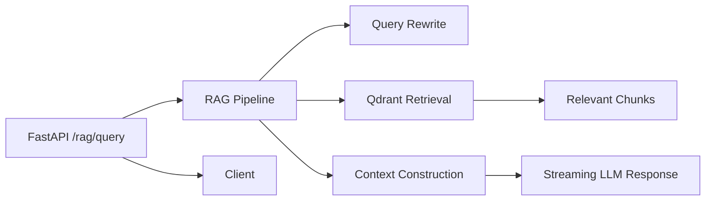

# RAG Backend

FastAPI backend for a **Retrieval-Augmented Generation (RAG)** system on RTU syllabus data, with **streaming LLM responses**, **filtered retrieval from Qdrant**, and **CI/CD deployment to AWS EC2 via Docker**.

---

## Repo Structure

```
root/
├── .github/workflows/deploy.yml   # CI/CD
├── app.py                         # FastAPI endpoints
├── Dockerfile                     # Docker build
├── rag_query_pipeline.py          # RAG logic
├── requirements.txt
├── schema.py                      # Pydantic schemas
└── system_messages.py             # LLM system prompts
```

---

## Key Features

* Streaming LLM answers (GPT-4.1-nano)
* Filtered retrieval from Qdrant by semester, subject, unit
* Query rewriting for better context
* CI/CD: Docker build → AWS ECR → EC2 deployment

---

## Backend Flow



**Flow:** User query → Query rewrite → Filtered retrieval → Context → Streaming LLM → Client

---

## API Endpoints

**Health Check:** `GET /health` → `{"status": "ok"}`

**RAG Query:** `POST /rag/query`

Request body example:

```json
{
  "query": "Explain Newton's laws",
  "chat_history": [{"role": "user", "content": "What are the laws of motion?"}],
  "filters": {"semester":2,"subject":"Physics","unit":4}
}
```

Response: streaming plain text

---

## Notes

* Streaming responses for real-time experience
* Filtered retrieval ensures relevant context
* Traceable functions allow debugging & observability
